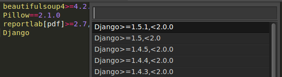
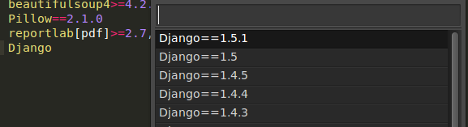

requirements.txt
================

Plugin for Sublime Text 2/3 providing autocompletion, syntax highlight and easy version management in requirements.txt files.

Installation
============

Install using Package Control or clone this repository into `Packages/requirementstxt` folder (WARNING: previously we used a dot in the package name here, but SublimeText3 changed the way it imports packages, and we need to fall back to ascii name)

Usage
=====

- Open any requirements.txt file or Set syntax: requirements.txt of newly created file.
- Start typing package name -> autocompletion should trigger automatically.
- When cursor is placed on a single line, press `Alt+,` to pin package to the most recent version but still in the current major line. For example, if the current version of xyz is 1.2.3, requirements.txt will generate following version line: xyz>=1.2.3,<2.0.0 following http://semver.org/.
- If you wish to hard pin most recent versions, use `Alt+Shift+,` -> line will be replaced with xyz==1.2.3
- If you wish to pin a specific version, press `Alt+.` (soft) or `Alt+Shift+.` (hard) and pick a version from a quick panel.
- Commands with `,` support mutliline and multicursor selections. If you wish to bring requirements.txt file up to date, just `Ctrl+A` & `Alt+Shift+`.
- Using requirements.txt also normalizes package names, so mysql-python becomes MySQL-python.

Screenshots
===========

*  Autocomplete
*  Completed
*  Select exact version for soft pin `Alt+.`
*  Select exact version for hard pin `Alt+Shift+.`
*  Automatically soft pin most recent version `Alt+,`
*  Automatically hard pin most recent version `Alt+Shift+,`
*  Multi-line selection
*  Multi-line selection & `Alt+,`
*  Multiple cursors
*  Multiple cursor & `Alt+Shift+,`
